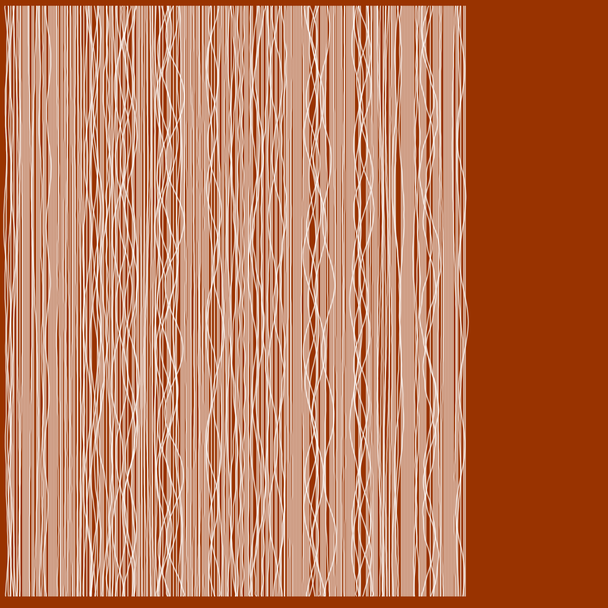

# ****

## **Initial Ideas**  
We started by ideating about the concept of **measuring** in a post scientific way from a hyperpersonal perspective. We speculated and questioned each other:  
- When does measuring stop facilitating and start preventing a process?  
- Are the usual measuring units opposite to replicability?  
- Why do we measure things?  ..to save time instead of doing everything by trial & error, capitalism, control outcome prediction.  

Other fields we wanted to explore were **storytelling**, the strict binary distinction between the 'positive' and the 'negative' of molds and objects.   

Eventually, our final idea emerged and triggered questions about...   
What if we can **store data** inside objects we use in our daily life?  
What is our **coffee cup is also a pen drive**, which has a song from your grandma or encrypted your passwords?  

What if we can store data into objects we use in our daily life?  
What is our coffee cup is also a pen drive, which has a song from your grandma or encrypted your passwords?  

## **Concept**  
We are creating a tool that will encode audio messages into physical objects, which will then be retrieved and sonified. it will read or listen the messages we give and will engrave them on ceramics. 
Cups, pots and other things will be carriers of our stories and will travel through time. 
It is a concept that deals with continuity and archiving.  

For this first prototype, we are writing audio messages in real-time. a microphone will capture the audio and through arduino it will convert the message into a sound waves, which will be getting written on a paper cup.  

The central idea has a lot of potential both on a theoretical, speculative level but also on the technological level. Based on our existing collective knowledge we approached this challenge with a 'realistic ambition'.    

## **Plan**   
We started imagining how it would look, what materials, motors and tools would we need. the more we tried to describe it, the more complex it got. multiple axes, motors, spinning wheels and plates started getting shape.. and that was only the hardware.  

This project made use of some parts rescued from an out of service reprap 3D printer that was left in out classroom from the 'tech beyond the myth' course, so we started by disassembling it. We used 2 servo motors, one for the turntable and one for the 2-axis. We also repurposed the controller boards which consistsed of an Arduino Mega and a Ramps 1.4 shield for the Mega. In addition to the electronics we were able to use the alumunim rails and various nuts and bolts from the old 3D printer to construct the drawing/carving machine. 

  

## **iterating**  
According to our predictions, we were relatively lucky. we managed to make our first laser cut pieces fit together (ok, with some sanding).  
We had to test the holes for the press fit a couple of times before sending our full printing file, which was different for each material. 

  

  

## **Problems and Improvements**  

We knew this would be an ambitious artifact to make, and we most likely wouldn't be able to complete it in the four days of the first micro challenge. We planned to make the first iteration of the prototype in the first week, which consists of a motorized turntable and an arm that could move up and down and hold different toolheads such as a pen. This first iteration was designed to write on a paper cup and test out our idea. 

Though we didn't have time to connect the sound input to the project, we did manage to connect a microphone and plot the sound on the Arduion serial plotter. We will be exploring the sound interface in the coming weeks. This week, we managed to build a simple turntable and motorize it, as well as create a frame for the z-axis that will serve as an interchangeable toolhead for pens and carving tools. We still have some work to do on the z-axis plate to correct some sagging as it moves up and down as well as redesiging it to better hold pens and tools. Though our rubberband solution works quite well, especially if there are only 4 days to build. :) 

## **Week 02**  

## **Design Dialogues**

Click on the image to view the presentation :)  

### Audio Generated Visuals  

To incorporate what we learned this term in our digital prototyping courses we decided to add a digital component to accompany the project. We planned to create a collection of digital assets based off the sound recordings that will be taken at the time of creating the cups. These digital twins will accompany each ceramic cup and stay on a digital archive online to represent the messages engraved in each cup.  The sound waves will be recorded in both the cups and into an audio file.

#### Processing  

We started working on making generative images from the sound recordings in Processing. We generated some still images based off the sound waves that we thought matched the aesthetics and feeling of the project. These images were generated with the audio recordings in Processing using the minm library based on this paper by [Manuel Kretzer](http://responsivedesign.de/wp-content/uploads/2016/05/tutorial-06_processing-soundmapping2.pdf). 

  

  

#### p5.js   

After creating these images we realized that we would like the media to be more interactive and decided to try out the sound recordings in a more interactive format with p5.js. p5.js will allow us to make interactive graphics that can be embedded as javascript on a webpage.  Here are the sample visualizations made in p5.js to accompany the sound recordings.

[Mother's Kitchen](https://editor.p5js.org/agjarv/full/4PX7xMz5z)  
[Grandmother's Kitchen](https://editor.p5js.org/agjarv/full/qOPdnXOsH)  
[My Kitchen](https://editor.p5js.org/agjarv/full/o7EYgK_W5R) 

[Edit Code](https://editor.p5js.org/agjarv/sketches/o7EYgK_W5R)

  

 

### Online Archive

We decided to create a webpage to host our archive of interactive media. The website can be found here: https://seherkrishna02.github.io/Andaaza/

Going further we would like to make a version of the p5.js sketch we created so that visitors to our webpage can interact and add to the archive. We got this feedback in our final presentation and we would like to incorporate it. This sketch will allow visitors to respond to the question "What message would you like to pass on to future generations?" They will be able to record and save audio and then modify select parameters of the sketch to customize the visual appearance of the animation. This sketch will be embedded in our archival webpage so that people can contribute to the archive even if they can't participate in the live intervention. 

## Useful Links and References  

[Using the Arduino AccelStepper Library](https://hackaday.io/project/183713-using-the-arduino-accelstepper-library)

[AccelStepper](https://github.com/waspinator/AccelStepper) Library

[Vinyl Record Cutting Lathe](https://fabacademy.org/2020/labs/digiscope/students/ambroise-devries/docs/p02.html) Fabacademy Project by Ambroise de Vries

[DIY Record Cutting](http://fab.cba.mit.edu/classes/863.09/people/lifeform/13/index.html) Fabacademy project by David Robert

## Our Personal Webpages

[Amanda Jarvis](https://agjarv.github.io/MDEF/term02/digitalprototyping/#micro-challenge-1)  
[Seher Krishna](https://seherkrishna02.github.io/mdef4/term2/04-Digital%20Prototyping%20for%20Design/)  
[Myrto Eirini Pappa](https://mypappa.github.io/MDEF/reflections/term2/prototyping/microchallenge%20i/microchallenge%20i/)  

