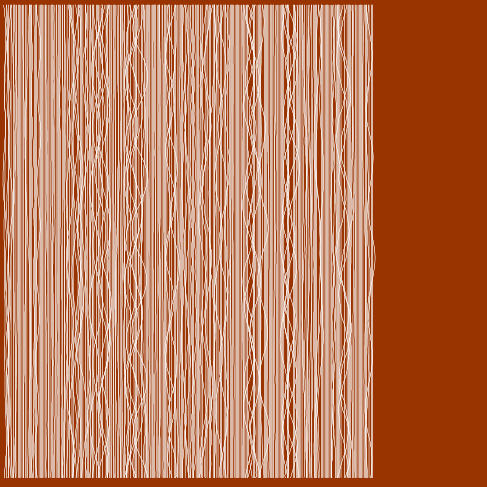
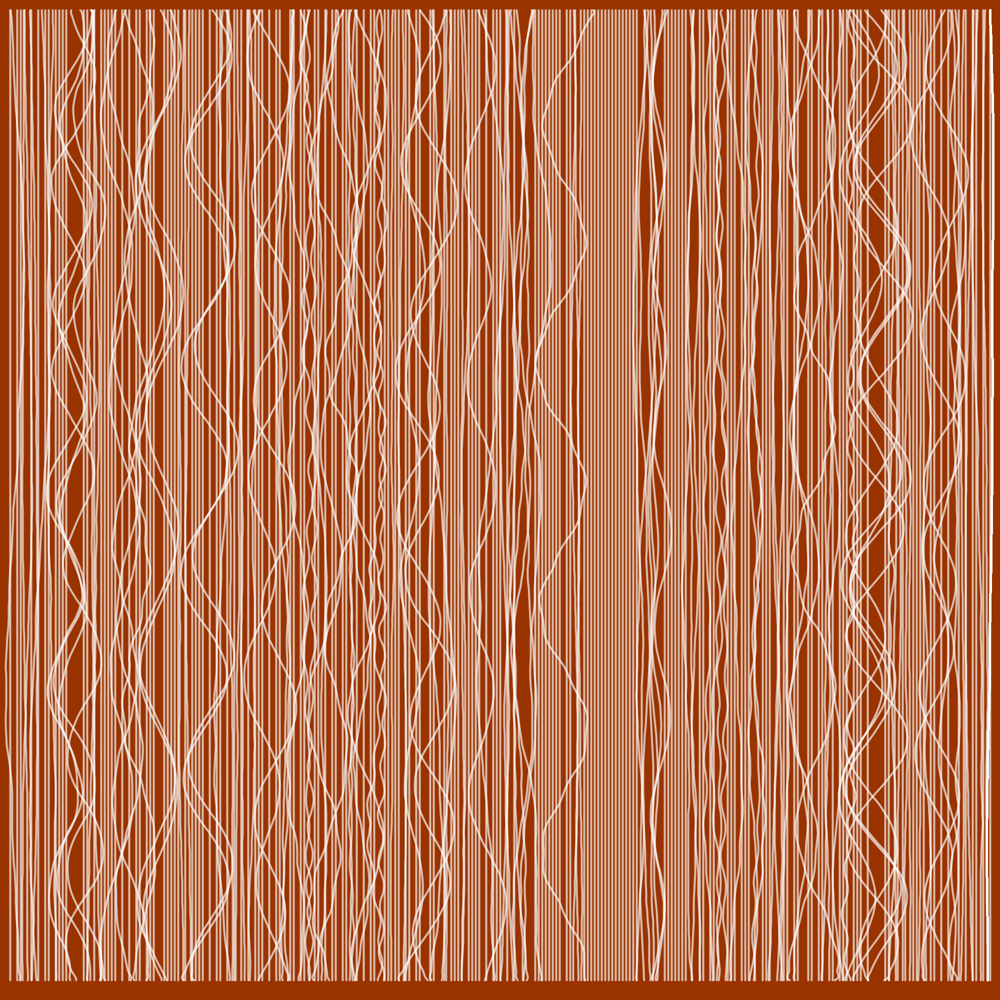

## Audio Generated Visuals  

### p5.js

This is an archive of the messages that are engraved in the cups. 
The sound waves are recorded in both the cups and into an audio file. 
A visualization was made in p5.js to accompany the sound recordings. 

[Mother's Kitchen](https://editor.p5js.org/agjarv/full/4PX7xMz5z)  
[Grandmother's Kitchen](https://editor.p5js.org/agjarv/full/qOPdnXOsH)  
[My Kitchen](https://editor.p5js.org/agjarv/full/o7EYgK_W5R) 

[Edit Code](https://editor.p5js.org/agjarv/sketches/o7EYgK_W5R)

### Processing  

These images were generated with the audio recordings in Processing using the minm library based on this paper by [Manuel Kretzer](http://responsivedesign.de/wp-content/uploads/2016/05/tutorial-06_processing-soundmapping2.pdf). 

  

  

